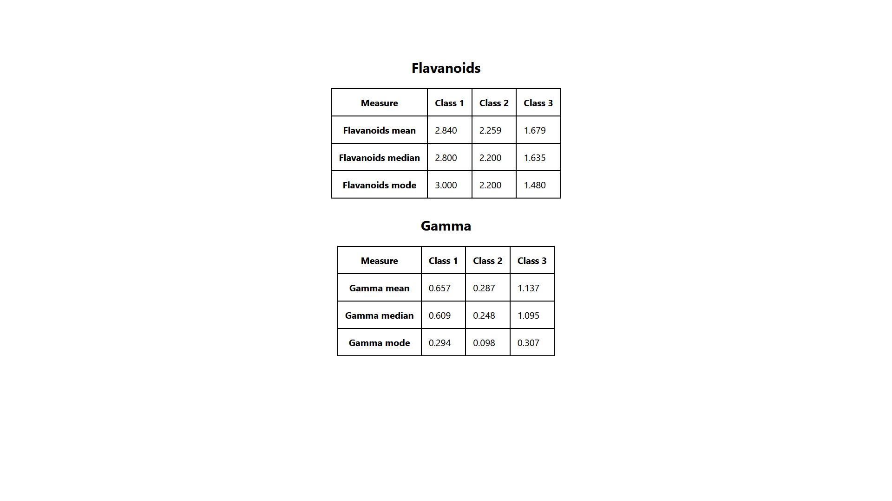

## Manufac Assignment

This submission is for the Manufac assignment. It calculates the mean, median, and mode of certain properties within a dataset, presenting the results in a tabular format.

### Instructions

To get started, execute the following commands in your terminal:

1. Run `yarn install` to install dependencies.
2. Run `yarn start` to start the application.

### Deployed link - https://manufac-ruby.vercel.app/

### Screenshot of resulting tables

